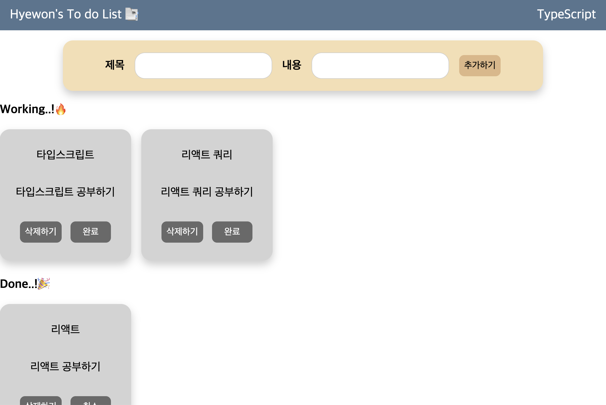

## typescript로 To Do List 만들기

### 프로젝트 소개

- 개요 : 타입스크립트를 통해 To Do List를 구현합니다.
- 개발 기간 : 2023.12.15 (1Day)

### 브랜치 설명

- level_1 : React 이용 TodoList
- level_2 : React + RTK(Redux ToolKit) 이용 TodoList
- level_5 : React + json-server + react-query 이용 TodoList

## 사용 기술

&nbsp;&nbsp;&nbsp;

## 주요 기능

- Todo 항목 추가하기
  - 사용자가 새로운 Todo 항목을 입력하고 추가할 수 있는 기능
- Todo 항목 목록 표시하기
  - 각 Todo 항목은 고유 식별자를 가짐
- Todo 항목 삭제하기
  - 삭제 시 사용자에게 삭제 확인 요청
- Todo 완료 상태 표시 기능
  - 사용자가 Todo 항목을 완료했음을 표시

